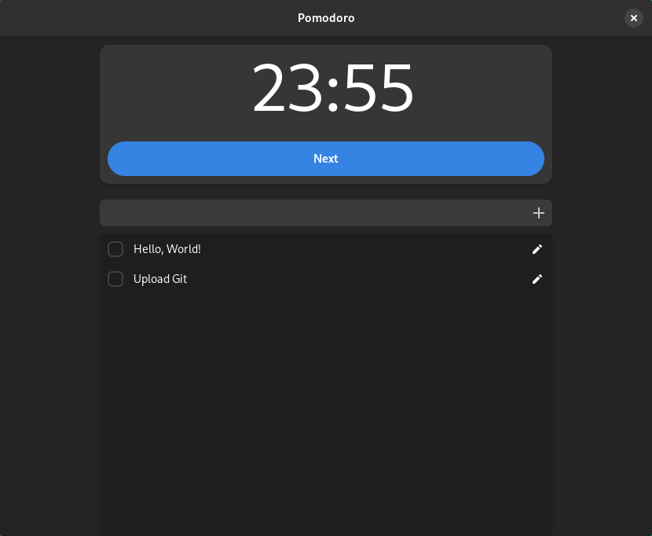

# Pomodoro (GUI)

A graphical Pomodoro and To-Do List application using GTK and libadwaita.



# Features

- [x] Simple Pomodoro
- [x] Simple To-Do List
- [x] Save/Store non-completed tasks

# Installation

Dependencies:

- [GTK](https://www.gtk.org/) 4.12+
- [libadwaita](https://gitlab.gnome.org/GNOME/libadwaita) 1.4+
- Rust+Cargo

## From Source

```sh
git clone https://github.com/robert-oleynik/Pomodoro
cd Pomodoro
cargo install --path .

# GLib settings
mkdir ~/.local/share/glib-2.0/schemas # May be necessary
cp local.app.Pomodoro.gschema.xml ~/.local/share/glib-2.0/schemas
glib-compile-schemas ~/.local/share/glib-2.0/schemas

# Optional (Will add this application to your application launcher)
cp Pomodoro.desktop ~/.local/share/applications
```

# External Resources

This repository contains a copy of the notifications sound provided in [porsmo] by Color Cookie.
If you want to use a command line tool for Pomodoro, I recommend using this tool instead.

[porsmo]: https://github.com/ColorCookie-dev/porsmo

# License

MIT
